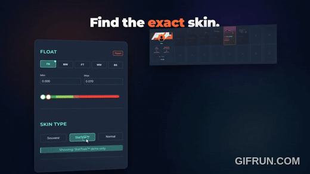

# Monsieur Skin : documentation d'ingénierie

Français | [English](README.md)

> Documentation uniquement. Le code source du produit est privé et propriétaire.
> Conçu, livré et exploité en solo par [Antoine Baudet](https://github.com/Baudet-Antoine).

## De quoi s'agit-il

Monsieur Skin est une place de marché entre particuliers pour échanger des skins CS2. La
plateforme ne détient jamais les objets (ils transitent par des offres d'échange Steam). Elle
gère deux choses autour :

1. **La partie cash** d'un échange (« 2 objets + 50 EUR »), conservée sous séquestre jusqu'à
   vérification de l'échange.
2. **La vérification** que l'échange Steam a bien eu lieu, par preuves cryptographiques plutôt
   qu'en faisant confiance à l'une des parties.

Les difficultés : deplacer de l'argent réel en securité, prouver ce qu'une API tierce a repondu
sans faire confiance au client, et garder le tout cohérent quand Steam, Stripe et le réseau
tombent en panne chacun a leur façon.

## Architecture en un coup d'oeil

Détail complet : [docs/architecture.md](docs/architecture.md) (en anglais).

## Les problèmes qui valent le détour

| Problème | à lire |
|---|---|
| Garder de l'argent une semaine sans portefeuille ni valeur stockée, et ne le libérer que sur livraison verifiée | [docs/escrow.md](docs/escrow.md) |
| Prouver ce que l'API Steam a répondu, depuis un navigateur non fiable, avec TLSNotary (prouveur WASM + vérificateur Rust) | [docs/tls-proof-flow.md](docs/tls-proof-flow.md) |
| Modèle de sécurité d'un produit qui manipule de l'argent et livre une extension navigateur | [docs/security.md](docs/security.md) |
| Stratégie de tests : tests de garde rapides et évals periodiques payantes | [docs/testing-evals.md](docs/testing-evals.md) |
| Pourquoi X plutôt que Y | [docs/decisions/](docs/decisions/) |

## Stack

- **Backend** : Node.js, Express, MongoDB (Mongoose), Socket.io, Stripe Connect, workers
- **Vérificateur** : Rust (axum, TLSNotary), derrière nginx
- **Extension** : Chrome Manifest V3, service worker, prouveur TLSNotary en WASM, CSP stricte
- **Frontend** : React 18, i18n (FR/EN/DE/ES/RU/CN), Stripe Elements
- **Ops** : VPS Linux, nginx, systemd, tests de charge k6, Sentry, alertes Discord

## En chiffres

- Plus de 1000 commits depuis juillet 2025
- Plus de 2 700 tests automatisés : ~1 930 backend (Jest), ~600 frontend (Jest), 185 extension (node:test), 28 vérificateur Rust (cargo)
- Mesuré le 2026-10-09
- 1 service Rust, 1 extension, 1 application web, 1 backend, en solo

## Mon rôle

Tout : produit, architecture, backend, frontend, extension, infrastructure, revue de sécurité,
exploitation. Developpé avec des assistants de code IA selon un processus strict (tests et évals
dans le meme commit, deux voies de tests, services avec contrats aux frontieres).

## Contact

- GitHub : [@Baudet-Antoine](https://github.com/Baudet-Antoine)
- LinkedIn : [@baudetantoine](https://www.linkedin.com/in/baudetantoine/)
- email : [antoine.baudet@monsieurskin.fr](mailto:antoine.baudet@monsieurskin.fr)

## Social

- X : [@MonsieurSkin](https://x.com/MonsieurSkin)
- Tiktok : [@monsieurskin.fr](https://www.tiktok.com/@monsieurskin.fr)
- Youtube : [@MonsieurSkin](https://www.youtube.com/@MonsieurSkin)
- Instagram : [@monsieurskin.fr](https://www.instagram.com/monsieurskin.fr)

## Licence

(c) 2026 Antoine Baudet. Cette documentation est sous licence
[CC BY-NC-ND 4.0](https://creativecommons.org/licenses/by-nc-nd/4.0/deed.fr).
Le code source de Monsieur Skin n'est **pas** inclus et reste propriétaire.
