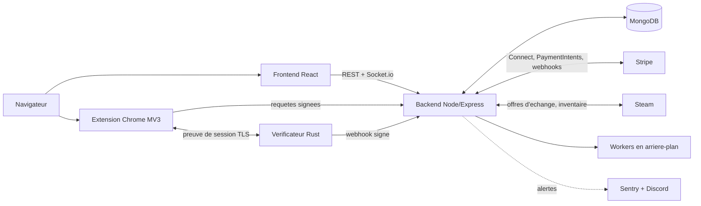

# Monsieur Skin : documentation d'ingenierie

Francais | [English](README.md)

> Documentation uniquement. Le code source du produit est prive et proprietaire.
> Concu, livre et exploite en solo par [Antoine Baudet](https://github.com/Baudet-Antoine).

<!-- TODO : demo de 60 a 90 s. Heberger sur YouTube (non liste), puis remplacer par un GIF cliquable :

-->

## De quoi s'agit-il

Monsieur Skin est une place de marche entre particuliers pour echanger des skins CS2. La
plateforme ne detient jamais les objets (ils transitent par des offres d'echange Steam). Elle
gere deux choses autour :

1. **La partie cash** d'un echange (« 2 objets + 50 EUR »), conservee sous sequestre jusqu'a
   verification de l'echange.
2. **La verification** que l'echange Steam a bien eu lieu, par preuves cryptographiques plutot
   qu'en faisant confiance a l'une des parties.

Les difficultes : deplacer de l'argent reel en securite, prouver ce qu'une API tierce a repondu
sans faire confiance au client, et garder le tout coherent quand Steam, Stripe et le reseau
tombent en panne chacun a leur facon.

## Architecture en un coup d'oeil

Detail complet : [docs/architecture.md](docs/architecture.md) (en anglais).

## Les problemes qui valent le detour

| Probleme | A lire |
|---|---|
| Garder de l'argent une semaine sans portefeuille ni valeur stockee, et ne le liberer que sur livraison verifiee | [docs/escrow.md](docs/escrow.md) |
| Prouver ce que l'API Steam a repondu, depuis un navigateur non fiable, avec TLSNotary (prouveur WASM + verificateur Rust) | [docs/tls-proof-flow.md](docs/tls-proof-flow.md) |
| Modele de securite d'un produit qui manipule de l'argent et livre une extension navigateur | [docs/security.md](docs/security.md) |
| Strategie de tests : tests de garde rapides et evals periodiques payantes | [docs/testing-evals.md](docs/testing-evals.md) |
| Pourquoi X plutot que Y | [docs/decisions/](docs/decisions/) |

## Stack

- **Backend** : Node.js, Express, MongoDB (Mongoose), Socket.io, Stripe Connect, workers
- **Verificateur** : Rust (axum, TLSNotary), derriere nginx
- **Extension** : Chrome Manifest V3, service worker, prouveur TLSNotary en WASM, CSP stricte
- **Frontend** : React 18, i18n (FR/EN), Stripe Elements
- **Ops** : VPS Linux, nginx, systemd, tests de charge k6, Sentry, alertes Discord

## En chiffres

- Plus de 1000 commits depuis juillet 2025
- Plus de 2 700 tests automatises : ~1 930 backend (Jest), ~600 frontend (Jest), 185 extension (node:test), 28 verificateur Rust (cargo)
- Mesure le 2026-10-09
- 1 service Rust, 1 extension, 1 application web, 1 backend, en solo

## Mon role

Tout : produit, architecture, backend, frontend, extension, infrastructure, revue de securite,
exploitation. Developpe avec des assistants de code IA selon un processus strict (tests et evals
dans le meme commit, deux voies de tests, services avec contrats aux frontieres).

## Contact

- GitHub : [@Baudet-Antoine](https://github.com/Baudet-Antoine)
- <!-- TODO : LinkedIn / email -->

## Licence

(c) 2026 Antoine Baudet. Cette documentation est sous licence
[CC BY-NC-ND 4.0](https://creativecommons.org/licenses/by-nc-nd/4.0/deed.fr).
Le code source de Monsieur Skin n'est **pas** inclus et reste proprietaire.
