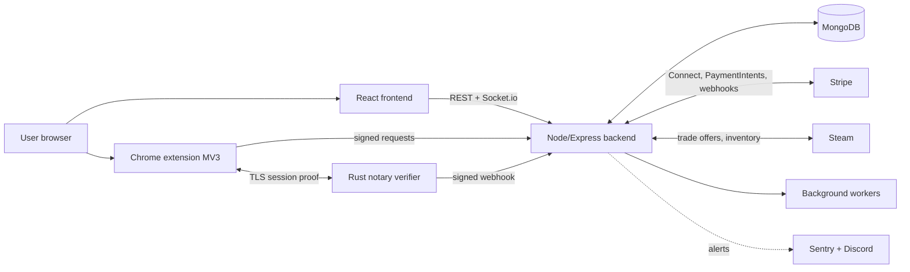

# Monsieur Skin: engineering write-up

[Francais](README.fr.md) | English

> Documentation only. The product source code is private and proprietary.
> Built, shipped and operated solo by [Antoine Baudet](https://github.com/Baudet-Antoine).

<!-- TODO: 60-90s demo. Host on YouTube (unlisted), then replace with a clickable GIF:

-->

## What it is

Monsieur Skin is a peer-to-peer marketplace for trading CS2 skins between users. The platform
never holds the items (they move through Steam trade offers). It handles two things around them:

1. **The cash leg** of a trade ("2 items + 50 EUR"), held in escrow until the exchange is verified.
2. **Verification** that the Steam trade actually happened, using cryptographic proofs instead of
   trusting either party.

The hard parts: moving real money safely, proving what a third-party API said without trusting
the client, and keeping all of it consistent when Steam, Stripe and the network each fail in
their own way.

## Architecture at a glance

Full breakdown: [docs/architecture.md](docs/architecture.md).

## The problems worth reading about

| Problem | Where to read |
|---|---|
| Hold money for a week without a wallet or stored value, and release it only on verified delivery | [docs/escrow.md](docs/escrow.md) |
| Prove what Steam's API returned, from an untrusted browser, with TLSNotary (WASM prover + Rust verifier) | [docs/tls-proof-flow.md](docs/tls-proof-flow.md) |
| Security model for a product that moves money and ships a browser extension | [docs/security.md](docs/security.md) |
| Test strategy: fast gate tests plus paid periodic evals | [docs/testing-evals.md](docs/testing-evals.md) |
| Why I chose X over Y | [docs/decisions/](docs/decisions/) |

## Stack

- **Backend**: Node.js, Express, MongoDB (Mongoose), Socket.io, Stripe Connect, background workers
- **Verifier**: Rust (axum, TLSNotary), deployed behind nginx
- **Extension**: Chrome Manifest V3, service worker, WASM TLSNotary prover, strict CSP
- **Frontend**: React 18, i18n (FR/EN), Stripe Elements
- **Ops**: Linux VPS, nginx, systemd, k6 load tests, Sentry, Discord alerting

## By the numbers

<!-- Refresh these before publishing. -->
- 1000+ commits since July 2025
- 180+ test files across backend, extension and frontend
- 1 Rust service, 1 browser extension, 1 web app, 1 backend, solo

## My role

Everything: product, architecture, backend, frontend, extension, infrastructure, security review,
operations. Developed with AI coding assistants under a strict process (tests and evals in the
same commit, two test lanes, services with contracts at the boundary).

## Contact

- GitHub: [@Baudet-Antoine](https://github.com/Baudet-Antoine)
- <!-- TODO: LinkedIn / email -->

## License

(c) 2026 Antoine Baudet. This documentation is licensed under
[CC BY-NC-ND 4.0](https://creativecommons.org/licenses/by-nc-nd/4.0/).
The Monsieur Skin source code is **not** included and remains proprietary.
