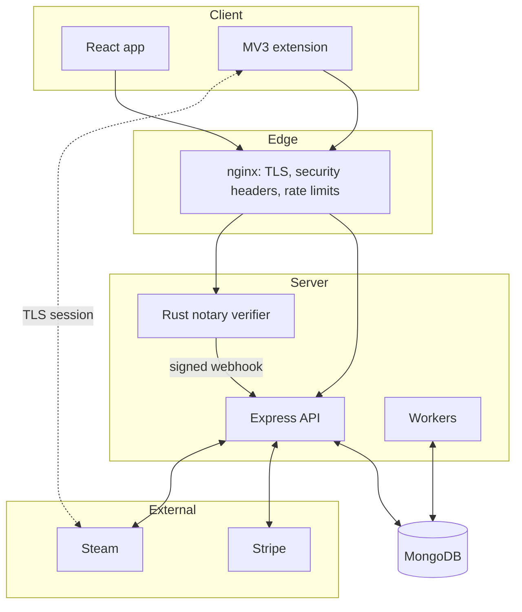

# Architecture

## Components

| Component | Tech | Responsibility |
|---|---|---|
| Frontend | React 18, react-router, i18next, Stripe Elements | Marketplace UI, offers, chat, payment and onboarding flows |
| Backend | Node.js, Express, Mongoose, Socket.io | REST API, trade state machine, escrow ledger, Steam bot sessions, realtime events |
| Workers | Node.js processes sharing backend code | Escrow verification, expiry, reconciliation, stuck-trade cleanup, dispute resolution, Discord summaries |
| Extension | Chrome MV3, WASM | Runs in the user's browser: reads Steam trade state, produces TLS proofs, signs reports |
| Notary verifier | Rust (axum, TLSNotary) | Co-witnesses the extension's TLS session with Steam and reports the verified transcript |
| Database | MongoDB | Users, offers, escrow records, ledger entries, notifications |
| Payments | Stripe Connect | Charges, deferred transfers, refunds, KYC onboarding |
| Observability | Sentry, Discord webhooks, k6 | Error tracking with throttling, critical-event alerts, load tests |

## Runtime view

## Design rules

- **One concern per module.** Routes call services, services own the state transitions. Workers
  reuse the same services, never their own copies of the logic.
- **Contracts at the boundary.** The verifier-to-backend webhook, the extension-to-backend
  payload and the public profile lookup each have a written contract and tests asserting it on
  both sides.
- **State machines over flags.** Trades and escrows move through explicit states. Transitions
  are idempotent and atomic, so a crash between two steps never loses money or double-pays.
- **Reconcile, do not trust.** An internal ledger is periodically checked against Stripe's real
  balance. A mismatch raises an alert instead of being silently absorbed.
- **Fail loud.** Critical backend events reach a Discord channel. Repeated errors are throttled
  so a single bug cannot exhaust the error-tracking quota.

## Background workers

| Worker | Job |
|---|---|
| Escrow verification | Checks the real Steam trade state, then releases or refunds |
| Escrow expiry | Closes escrows whose window ended without resolution |
| Reconciliation | Compares the internal ledger with Stripe |
| Stuck-trade cleanup | Cancels cash trades or mobile confirmations that stalled |
| Dispute resolution | Resolves flagged cash trades |
| Summaries | Posts operational digests to Discord |
