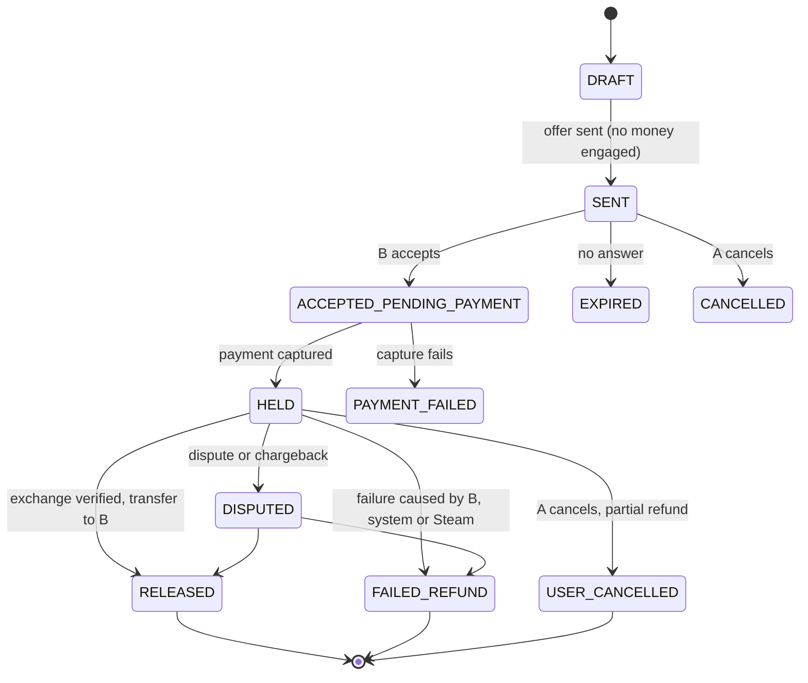

# Transactional escrow without stored value

## The problem

User A offers "2 items + 50 EUR" to user B. The items move through Steam. The 50 EUR must be
safe for both sides: B must not be paid if the items never arrive, and A must not lose money if
B does not deliver. Steam can also reverse a trade days later, so "the trade looked fine on day
one" is not proof.

## Constraints I set

These are design invariants. Any implementation that breaks one is rejected.

1. **No stored value.** No wallet, no reusable balance. Every movement of money belongs to one
   transaction.
2. **Funds stay in Stripe's custody** until settlement. No intermediate sweep to a bank account
   controlled by the platform.
3. **Refunds return to the original payment method**, never to a balance.
4. **Release is conditioned on verification**, not on elapsed time alone.
5. **Fees are retained only for a stated cause.** A blanket "keep the fee on every refund" rule is
   an unfair contract term and a chargeback generator.
6. **Only earned fees** are paid out to the platform's own bank account.

## Flow

Key property: leaving `SENT` is free. Nothing is captured until B accepts, so offers that get no
answer cost nobody anything. Refunds only happen from `HELD`, after capture.

## Stripe pattern

**Separate charges and transfers.** Capture on the platform at acceptance, then a deferred
`Transfer` to B's Connect account after verification, or a `Refund` on failure. A destination
charge was rejected on purpose: it transfers immediately and would break the hold.

## What makes it hold up

- **Idempotency keys** on every Stripe object creation, so a retry cannot double-charge or
  double-pay.
- **Atomic, replayable transitions.** A crash between capture and persistence must not lose the
  escrow. Workers can re-run any step.
- **Webhooks handled idempotently**: payment success and failure, refunds, disputes, transfers,
  account updates.
- **Reconciliation worker** compares the internal escrow ledger with the real Stripe balance and
  alerts on drift.
- **Lazy KYC.** A user only onboards to Stripe Connect the first time they need to receive money.
  Acceptance of a cash offer is blocked until the recipient can actually be paid.
- **Payout schedule controlled** so escrowed funds on the shared Stripe balance cannot be swept
  out by an automatic payout.

## Trade-offs I accepted

- Holding funds for a week means capturing them. A refund after capture costs the original
  processing fee, so the platform fee is sized to absorb that.
- An authorization kept alive for 7 days would expire around the same time as the Steam
  verification window, so capture-then-hold is safer than authorize-then-wait.
