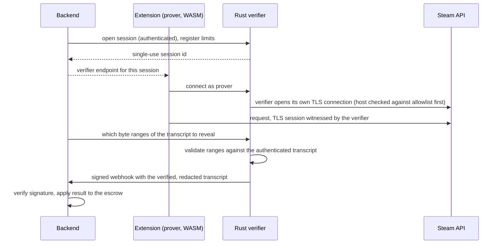

# Proving what Steam said: TLS proof flow

## The problem

To release money, the backend needs to know a Steam trade really completed. Asking the user's
browser "did it complete?" proves nothing: the client can lie. Calling Steam from the server on
the user's behalf needs the user's credentials. I wanted a third option: the user's own browser
fetches the data, and a verifier I run can confirm, cryptographically, what Steam returned.

## The approach: TLSNotary in proxy mode

TLSNotary lets a prover (the browser) and a verifier (my server) jointly witness a TLS session
with a third-party server. The verifier learns that a given server really sent a given
transcript, without being able to forge it and without seeing parts the prover chooses to redact.

## Why this design

- **The verifier dials Steam itself.** The extension cannot make my server connect to arbitrary
  hosts: the target name is checked against an allowlist before any connection.
- **Session ids are single-use and unguessable**, issued by the backend only.
- **The result travels as a signed webhook.** The signature scheme is a written contract with a
  shared test vector asserted on both sides (Rust and Node), so the two implementations cannot
  silently drift.
- **Redaction.** Only the transcript ranges the backend asks to reveal are disclosed. Credentials
  in the request are never part of what the backend sees.

## Components involved

| Piece | Language | Notes |
|---|---|---|
| Prover | Rust compiled to WASM, running in the extension's offscreen document | Vendored and rebuilt through a scripted step so the shipped build matches the source |
| Verifier | Rust (axum) | Own repo-level service with contract, tests and hardening tests |
| Backend session service | Node.js | Opens verifier sessions, hands the endpoint to the extension, consumes the webhook |

## What I learned

- Cryptographic proof only helps if every surrounding component is also locked down. Most of
  the real work was the plumbing: allowlists, authentication on the control channel, replay
  protection, and removing any endpoint that could be abused as a relay.
- Contract tests across two languages are cheap and catch the exact class of bug that is
  hardest to see in review.
